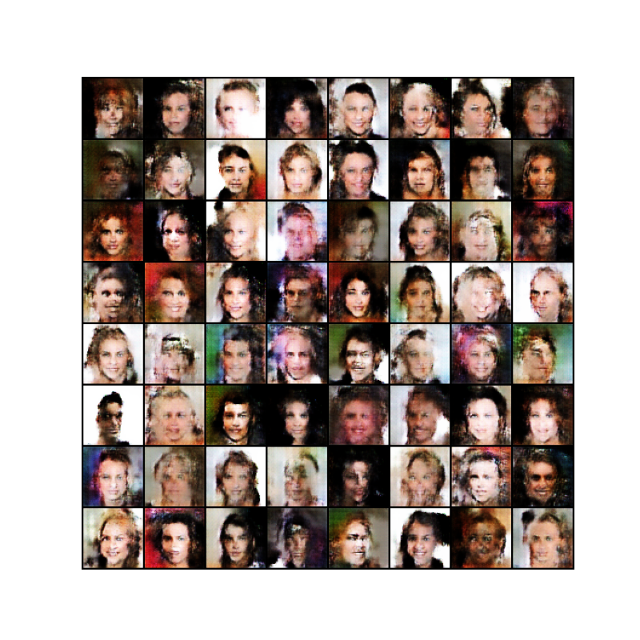
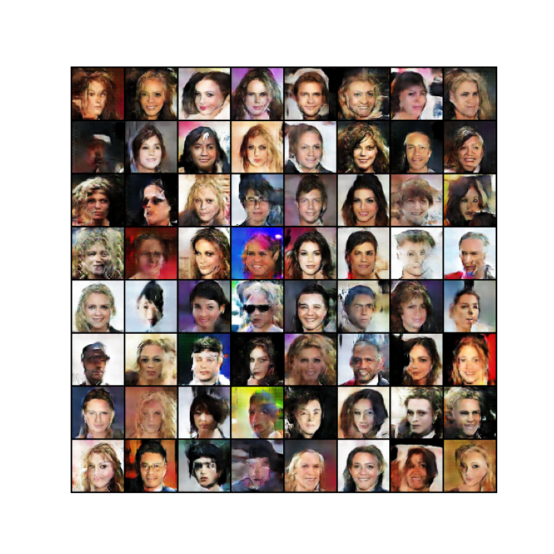
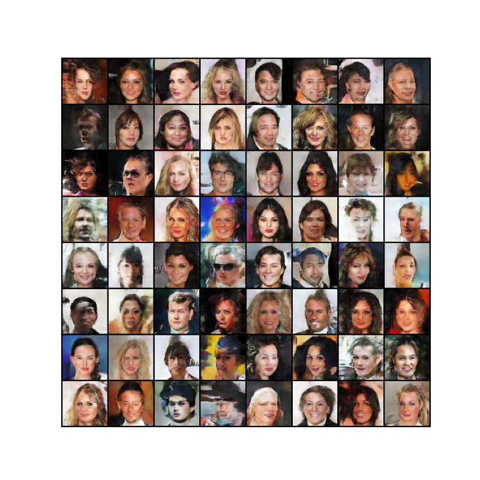
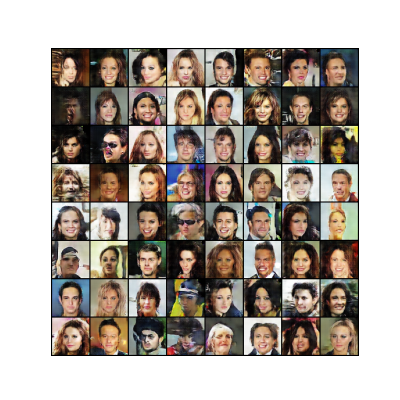
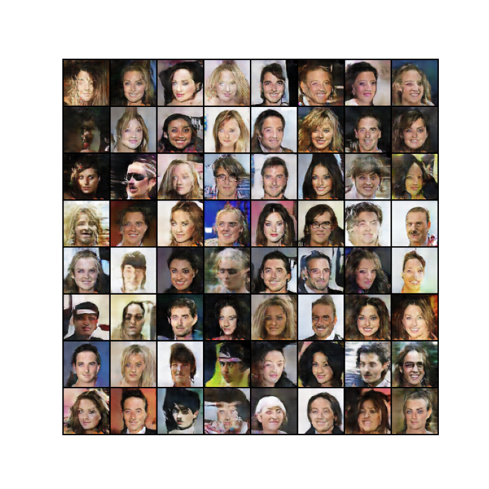

# DCGAN Face Generation with CelebA

A PyTorch implementation of a **Deep Convolutional Generative Adversarial Network (DCGAN)** for generating synthetic face images using the **CelebA** dataset.

The project trains two competing neural networks:

- a **Generator**, which converts random latent vectors into synthetic `64 × 64` RGB face images;
- a **Discriminator**, which learns to distinguish real CelebA images from generated images.

As training progresses, the generator learns increasingly realistic facial structure and appearance.

## Architecture

### Generator

The generator receives a random latent vector of size `100 × 1 × 1` and progressively upsamples it using transposed convolutions.

```text
Random noise (100 × 1 × 1)
        |
        v
ConvTranspose2d -> BatchNorm -> ReLU
        |
        v
ConvTranspose2d -> BatchNorm -> ReLU
        |
        v
ConvTranspose2d -> BatchNorm -> ReLU
        |
        v
ConvTranspose2d -> BatchNorm -> ReLU
        |
        v
ConvTranspose2d -> Tanh
        |
        v
Synthetic RGB face (3 × 64 × 64)
```

### Discriminator

The discriminator downsamples an input RGB image using convolutional layers and outputs the probability that the image is real.

```text
RGB face (3 × 64 × 64)
        |
        v
Conv2d -> LeakyReLU
        |
        v
Conv2d -> BatchNorm -> LeakyReLU
        |
        v
Conv2d -> BatchNorm -> LeakyReLU
        |
        v
Conv2d -> BatchNorm -> LeakyReLU
        |
        v
Conv2d -> Sigmoid
        |
        v
Real / Fake probability
```

## Training Configuration

The original experiment used:

- Dataset: CelebA
- Image size: `64 × 64`
- Latent dimension: `100`
- Batch size: `128`
- Adam optimizer
- Learning rate: `0.0002`
- Adam β1: `0.5`
- Binary cross-entropy loss
- Generator output activation: `Tanh`
- Discriminator output activation: `Sigmoid`

The supplied experiment folder contains generated samples through epoch 20. The cleaned training script defaults to 35 epochs, matching the original training configuration.

## Generated Face Progression

The same fixed latent vectors are used to generate a face grid after each epoch. This makes it easy to observe how the generator improves during training.

### Epoch 1



### Epoch 5



### Epoch 10



### Epoch 15



### Epoch 20



All available epoch outputs can be found in:

```text
results/generated_samples/
```

## Repository Structure

```text
.
├── src/
│   ├── network.py
│   ├── train.py
│   └── generate.py
├── data/
│   └── README.md
├── models/
│   └── README.md
├── results/
│   ├── README.md
│   └── generated_samples/
│       ├── epoch_0001.png
│       ├── ...
│       └── epoch_0020.png
├── requirements.txt
├── .gitignore
└── README.md
```

## Dataset

This project uses **CelebA**, a large-scale face image dataset.

The full dataset is not stored in this GitHub repository. See `data/README.md` for the expected local folder structure.

## Installation

```bash
pip install -r requirements.txt
```

## Training

Place the CelebA images in the expected `dataset/` structure and run:

```bash
python src/train.py --data-dir dataset --epochs 35
```

The script saves:

- generated face grids after every epoch;
- generator weights;
- discriminator weights;
- generator/discriminator loss curves.

## Generate New Faces

After training:

```bash
python src/generate.py \
  --weights models/generator.pth \
  --num-images 64
```

The generated face grid will be written to:

```text
results/generated_faces.png
```

## Implementation Improvements

The original project code was cleaned for GitHub portability and reproducibility.

Changes include:

- removal of machine-specific `/home/...` paths;
- command-line arguments for data, output, and model locations;
- corrected DCGAN weight initialization;
- loss tracking across the entire training process;
- generator and discriminator checkpoints saved as `state_dict` files;
- a separate inference script for generating new faces;
- removal of cache files and unused experimental code.

## Key Takeaway

DCGAN demonstrates how convolutional generator and discriminator networks can learn the visual distribution of a face dataset without explicit labels. Starting from random latent vectors, the generator progressively learns facial structure, color, and texture through adversarial training.

## Disclaimer

The generated images are synthetic and are intended for machine-learning research and educational demonstration.
